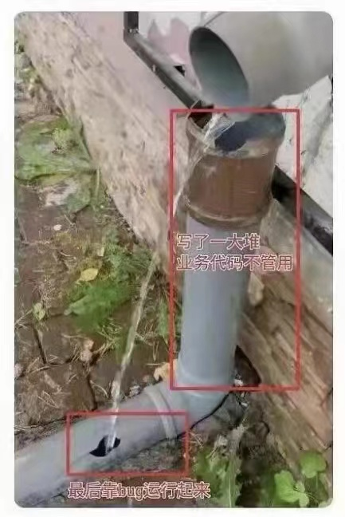

<!--more-->
* TOC
{:toc}

# 1. 现象

有次写了几百行的短信网关，过后一个下午去用户现场参加**上线马拉松**(软硬件集成商的代表一起驻场、连轴转，直到用户满意)，因为据说第二天用户的全国客户就要使用短信报名。到晚上各个集成商的子系统上线对接后发现协议有问题，大伙改到21点，现场二十号人开始发动自己的朋友圈发短信测试：给每个朋友说发什么到XXX号码，收到什么是对的，陆陆续续出现很多人没收到报名结果的短信。一顿排查猛如虎，最后定位到短信平台对服务号码的测试流量做了限制，已是凌晨3点。我趴桌子睡到5点，隔壁厂商的VBer一直在找短信内容太长就丢失的原因，最后到下午用户领导签字验收，大伙才回去，那名VBer据说后来被毕业了。

做过ToB项目的朋友都熟悉这种上线的煎熬，看上去小项目的投入少、情有可原，其实大中型项目的翻车事故也不少，和用户的IT成熟度也有潜在的关系，下面是一些案例。

# 2. 翻车表演

### 表演

1. 系统不是期望的型号和版本，补丁包装不上。
2. 开机启动不奏效。
3. XXX功能，运行结果明显不符合事实。
4. XXX功能，每到夜间3点不能用，有时自动恢复，有时只能重启机器。
5. 没有承诺的XXX功能。
6. 和第三方系统对接不成功。
7. 第三方系统故障，导致我方无法正常工作。

用户是翻车表演的资深观众，一看势头不对，投诉飞快流转到乙方(某类产品提供商)，产品研发部门的反馈就像小孩口袋中的宝贝，五花八门，让现场人员震惊，下面把反馈划分为几类：

### 部署

1. 没在Fedora 37 Server上试过XXX，不能联网升级吗？
2. 是先在A服务器装A1、A2，再去B服务器装B1的吗？装B1时选择了A的地址吗？
3. 杀过毒嘛？
4. 安装目录放到杀毒软件的白名单了吗？
5. 你那有安装手册嘛？

### 异常

1. 有50个并发客户端，怎么1台服务器才插了1根网线？
2. 我这跑性能测试用例没问题，现场用的XXX设备测试过性能嘛，网络质量咋样？存储带宽和IOPS咋样？
3. 跟踪2天再现了问题，是系统时间不对导致的。为什么现场NTP同步没生效，最近网络拓扑是不是变了？新防火墙过滤了NTP数据包？

### 功能

1. 没听说要开发这个功能？
2. 这个功能都没开发完，怎么跑去部署了？
3. 这个功能没法和你向用户承诺的另一个功能同时使用！
4. XXX功能要有YYY环境和设备，现场具备吗？
5. 什么，某项功能又要改成上周那个版本？
6. 什么，要改为支持XXX厂家设备？

乙方一到上线才发现无法如期交付，说明感染了**上线综合症**。

# 2. 原因

不幸的家庭各有各的不同，先看看ToB项目的特点，一些专注于为某些ToB行业提供解决方案的企业，作为乙方和不同的行业甲方签署合同项目，合同中普遍承诺：

1. 乙方把实现甲方需求的软硬件产品部署到甲方的私有云环境。
2. 作为1的一部分，乙方对接甲方不同时期的遗留系统。
3. 本次项目依赖的运行环境可能是甲方先前遗留的，也可能是伴随项目计划逐步建设。包括机房、网络、第三方设备，视项目而定，也许还有指定的服务器、PC机、特殊设备。
4. 项目在某个日期开始部署上线，乙方派出实施人员在甲方现场完成软硬件的安装、部署、调测，进入试用阶段，并支持甲方在某个日期验收项目。

甲方的一个项目中往往涉及多个乙方供应商、多种角色、复杂的软硬件环境，以及一些定制化功能，这些因素的综合影响下，乙方翻车的原因也不止一个，若不能全局掌握项目的目标和质量，免不了交学费。

### 2.1. 需求不一致

用户的诉求源自业务痛点和情感期待，如何高效、低成本地转化为一个个可量化的功能，需要高质量的持续沟通，优雅融合内外部资源、项目管理、产品技术解决方案及依赖的基础设施，不是写几个泛泛的设计方案，讨论讨论就能全面掌控的。下面现象就说明甲方和乙方对于做成什么样，缺乏明确的对齐，会让彼此付出显著的额外成本。

1. 用户和业务专家商讨出想要的东西，在经过多个关联方的传达和展开后变味了，直到上线才知道。
2. 用户想要的，经过实际使用产品后，改变了想法，开始修改需求、加功能，甚至影响到技术解决方案。
3. 用户想要的，存在摸棱两可，一直未能就如何落地达成共识，大家都认为先上线再说，最后双方瞠目结舌。

4. 有多个用户，每个用户都有自己想要的，存在矛盾，难以全面、合理地捏合到一起。
5. 产品的关键功能和产品间的互操作，做成什么样子，多方没有明确的、统一的认识，直到上线发现相互过高期待，甚至出现重大漏洞。

发生这些现象后，企业的一致做法是迅速从产品研发团队抽调人手，和实施人员组成特种兵，高效配合铺平崎岖的交付道路。但其实不管他们效率如何，这些都是意料之外的成本，不发生问题、少发生问题、只发生低成本修复的问题，才叫高明。**事后不能缺少闭环的精益思考。**

### 2.2. 质量不合格

质量不好，安装和使用困难，这类问题最多，有的很快能解决，有的需要高昂的时间成本，给用户留下粗制乱造的不良印象。

1. 产品UI体验不好，操作拧巴。
2. 技术解决方案无法支撑现场的环境、数据、使用方式。
3. bug多，测试不充分。
4. 运维成本高，分析现象的时间太长、效率太低。
5. 可靠性不足，换台设备就产品无法使用。

### 2.3. 环境不一致

1. 甲方、甲方运行环境的承建方和乙方，三者没对齐最终环境的详细数据，使得产品研发部门无法按照最终环境做检验。
2. 基于1，产品研发部门不知道在最终环境下需要额外做什么，做多长时间，实施人员更不知道，全体忽略这个环节，导致计划时间不足。

### 2.4. 实施准备不足

实施是实际检验产品的重要阶段，在项目进展的时间线上，晚于需求分析、产品设计、研发和测试。

1. 实施人员不知道这三者的匹配度：用户想要的、产品能提供的、产品依赖的环境。
2. 实施人员临到上线才拿到最终产品，没有充裕时间熟悉产品的安装、使用、排查现象等。
3. 实施人员需要处理诸多现场的事务沟通、会议等计划外的工作。
4. 实施人员缺少分析产品和软硬件环境的运维技能。
5. 实施人员的定位模糊：
  * 我在帮助用户建设一套业务系统？
  * 我是帮助企业的产品研发部门安装系统？

### 2.5. 项目管理不足

大型翻车事故不管涉及哪些业务技能，都是项目执行的失败，而不能简单的认为这是某一个部门、某一个角色、某一个人(包括项目经理本人)的事。面对复杂的内外部环境，项目管理更要做好，全面掌控目标、进度、质量，提前预防风险，用低成本的项目管理手段化解交付风险、实现最大化的投入产出比值，才能在错综复杂的ToB环境中脱颖而出。

# 3. 三板斧

这时候可以试试下面三板斧。

## 3.1. 质量

首先，识别业务部门的职能特点，抓关键角色、关键输出的质量：产品有没有和用户对齐功能和运行环境？你们喜欢这样操作吗？开发有没有自测？核心功能有没有自动化测试？测试有没有用例？部署能不能自动化？实施用过产品吗？测试能提供和现场一致的运行环境吗？项目经理知道上面这些问题的答案吗？

其次赋予大家服务意识的格局，去把下游同学当用户、当初恋，另外由于每个人背景不同，对于质量的定义也不同，要带大家看看高山、看看各自领域里什么叫作高质量。

// 但凡一个人的输出成果，动不动经不住其他人的提问就是明显不足。

研发制造业务不像生产线上的计件任务，容易评估质和量，二个东西表面看上去都能用，但解剖内部，考虑到性能、可靠性、可维护性，就发现千差万别，比如这张内涵丰富的图：

高质量产出也离不开高投入，对于有能力做好的人，应投入资源、时间，帮他定好方向，让他发挥、做到极值。同时对于软件开发活动，应该让听得见战场上炮声的人做决定，不要光陷入堆叠功能，也必须把代码重构、自动化测试、CI和CD纳入到研发计划，每个开发任务尽量不仅仅考虑眼下，而着眼于未来，因为只有这些经历丰富、听过炮声的人才知道，一个软件不具备可靠性和可维护性会多么的可怕，慢慢腐蚀多少人的时间、精力和信任。

## 3.2. 流程

流程被设计来让每个角色做正确的事、把擅长的事做到极值，首要目标是避免多人协作时1 + 1 < 2，最后达到1 + 1 > 2。虽然书籍和网上文章里一大堆的流程方法论，但别人的流程未必适合你，再完美的流程，落地时会变味，同样的流程，不同团队的执行结果都不同。领导者要有拿住流程核心本质的技能，根据当时当下的内外部环境，酌情裁减、顺势而为。

领导者可以做到这些：

1. 制定并公开发布工作流程。
2. 从声誉和利益上对每个人施加影响：每经过一个时间周期或项目周期，亲自主持让下游角色为上游角色的近期输出成果、包括学习成果来打分，并允许讨论，然后把成绩作为一类绩效公开发布。
3，领导者根据2可收获每个人的能力、性格、行为底层逻辑，为人员安排、流程改进提供了事实依据，而不是依靠感觉。
4. 领导者不懈余力的带头执行流程，如果你都无法坚持，别人又怎么可能。
5. 恶补翻车项目中的教训，比如bug多就要求自测、环境没对齐就投入虚拟化和运维自动化技术，需求遗漏就加强多方确认、不会部署和运维就在公司对着文档多实操。并且要求做这些工作的程度可被量化，比如自动化脚本安装20次、自测20次、分析10次网络故障，而不是泛泛的要求做，导致无法分辨做做表面功夫和做好。

## 3.3. 组织

一切组织和流程都是服务于企业的商业模式，选择了ToB就要考量这个赛道的特点，组织架构如何搭建、需要哪些人员角色、用什么流程实现1 + 1 > 2，都要为商业模式和赛道特点做支撑、做适配。

比如一般民用的ToB行业具有下面这些特点：

1. 技术选型、产品体验的发展趋势滞后于ToC。
2. 甲方内部可能分为建设方和使用方，一个项目的内外部环境复杂，功能和性能的要求不够清晰、具体，容易变化。
3. 要求系统具备相当高的可靠性、可维护性，发生故障时需要很高的应急反应措施。
4. 对于乙方来说，客户越多，系统私有云部署的越多，运维支持的成本越高。

基于这些前提，说明你的团队可以不要求最好的技术人才，但要妥善处理需求不确定、协作方较多带来的影响，需要在环境虚拟化、环境标准制定和数字化测量等运维领域投入资源，用技术手段去降低运维成本，认知不能停留在有个码农就开干的原始状态。落实到行动上来：

1. 由于产品研发团队同时做多个项目，要设置一位强有力的项目经理担任参谋长角色，他从大局出发，内部横向管理、外部直接面向实施人员和用户，全局一盘棋。这要求他具有全面的技能，最好是技术出身，因为一位没上过前线的参谋制定的作战计划，难免太多破绽。
2. 项目的需求范围要经过解决方案设计，得出主体的研发计划，并根据过去经验留出富余时间，设计后的功能清单、功能使用方式等，要得到用户的认可，这点非常重要。很多人提到ToB用户哪能你想找就能找的，实际上凡事都有更好的方法。
3. 工程实施时有许多杂事，也依赖技术支撑，会成为决定成败的关键点，从项目实施和打造产品的初衷出发，应考虑把实施人员纳入产品研发团队，让他们由同一个领导来指挥、支持和考评，避免计划不统一、信息不畅、互相推诿，比如会出现谁、哪天、去哪个现场、待几天、需要些什么这样的安排都让其他同学措手不及。但由于实施人员往往充当市场活动的尖兵，所以项目经理要做好协调。
4. 人是成本也是资源，关键岗位上花3个人的钱招2个人，用项目流程来驱动，干4个人的活，远远甚于招5个人给6个人的钱，干3个人的事，要积极反思由于缺乏行业认知带来的招聘价值观。
5. 通过流程中的上下游评价，调整关键岗位上技能和态度都不足的角色。
6. 长远看内部的人和外部的环境都会变化、流失，而团队大多数时间陷入业务，日积月累的消耗后，心智和情绪堆满了垃圾，领导者应着眼于行业和商业模式的发展趋势，带大家看未来、看自我定位，同时提升团队的底层技能比如学习能力、沟通能力、共情能力、时间使用和劳逸结合的工作方法，因为每个人的效率最后都逃不开自然规律的方程式。一个管理层缺乏主动学习的团队，自然无法从更高层级看待和解决问题，实现精益化超越。